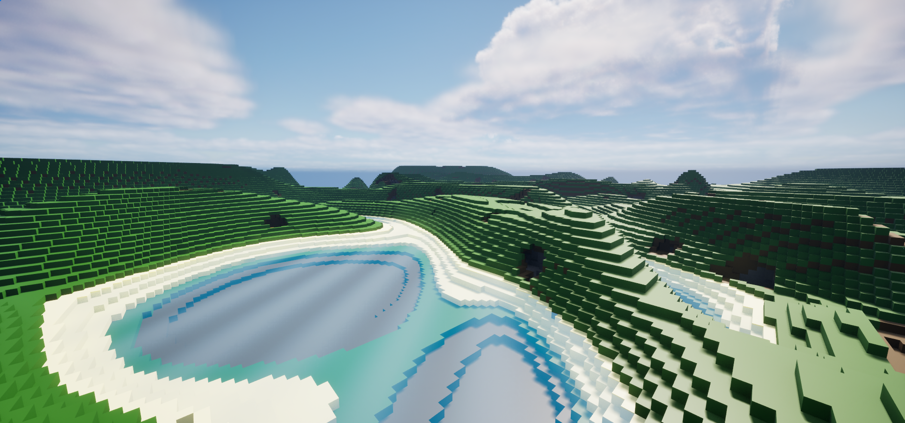

# Fun With Cubes

This is a simple demo of infinite voxel terrain generation in Unreal Engine 5.



## How to run

### Prerequisites

You will need to have the following software installed in order to build and run this project. 

If you're on Windows:

1. Unreal Engine 5.3.2
2. Visual Studio 2022
3. Git For Windows

If you're on Linux:

1. Unreal Engine 5.3.2
2. Clang compiler
3. An IDE/editor which supports UE5 (e.g. JetBrains Rider, VS Code)
4. Git

### Procedure

First, clone this repository.
```shell
$ git clone git@github.com:Adanos020/FunWithCubes.git
```

Then, open FunWithCubes.uproject in Visual Studio or Rider.
Once the project finishes loading, compile and run.

Opening this project directly with Unreal Engine may result in an error: "The following modules are missing or built with a different engine version".
